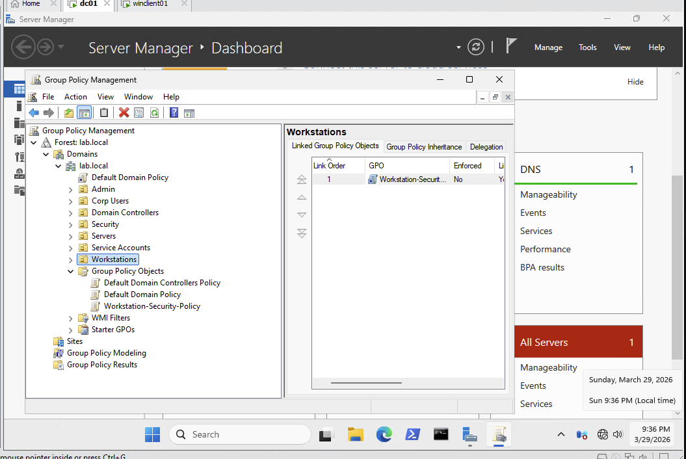
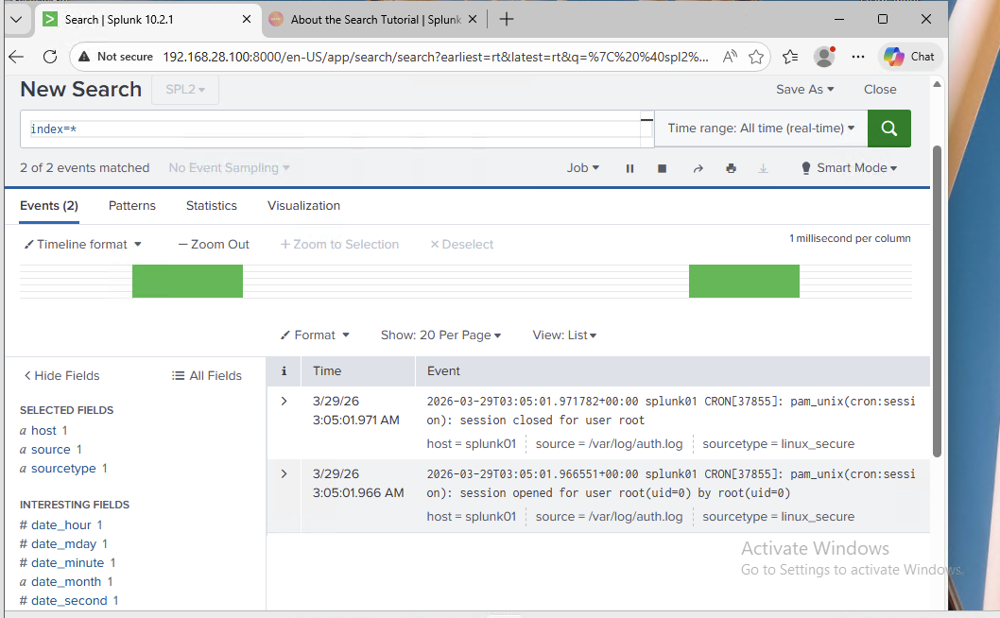
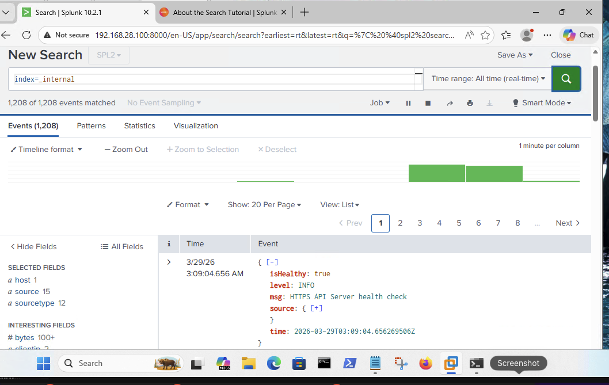
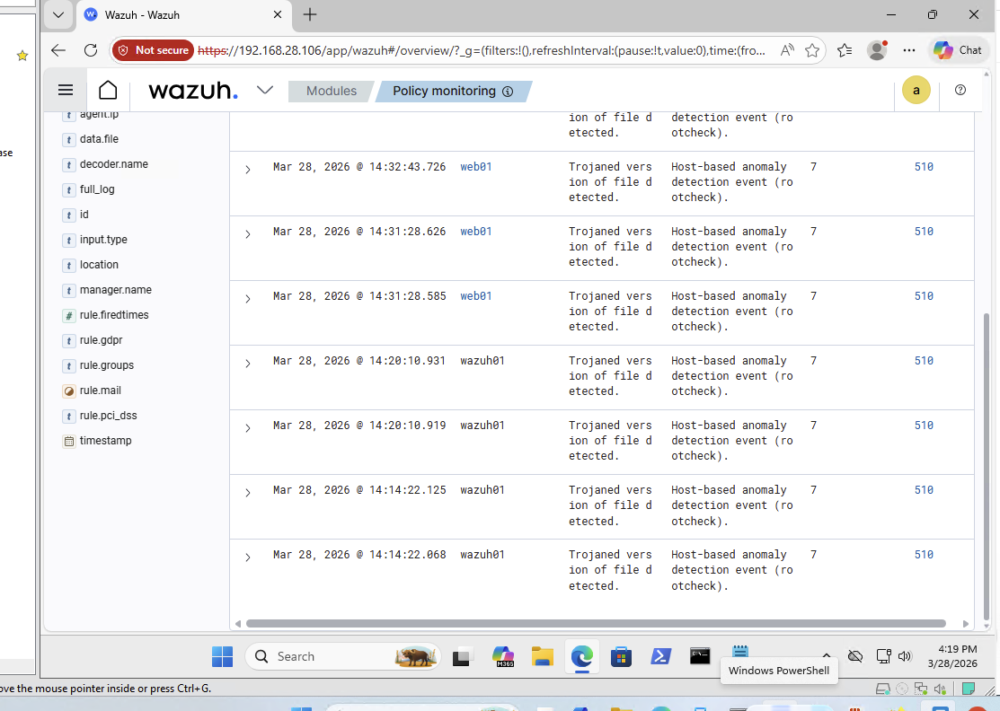
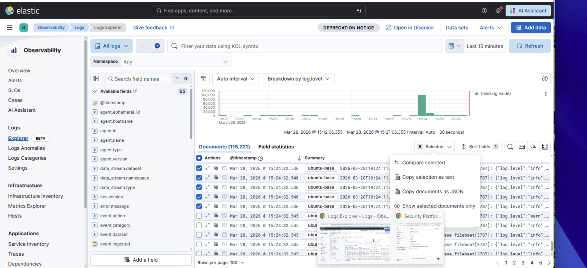
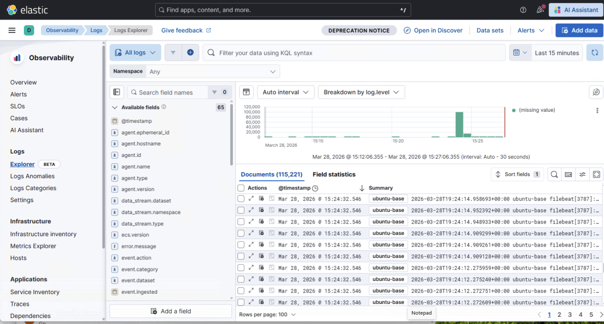
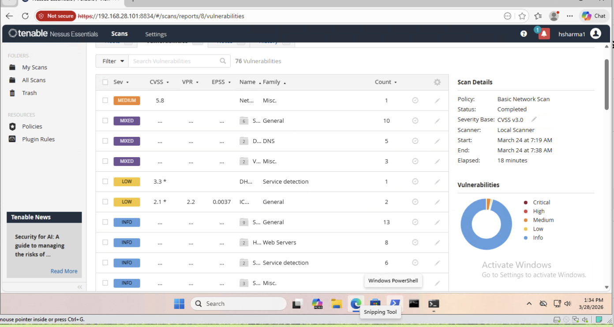
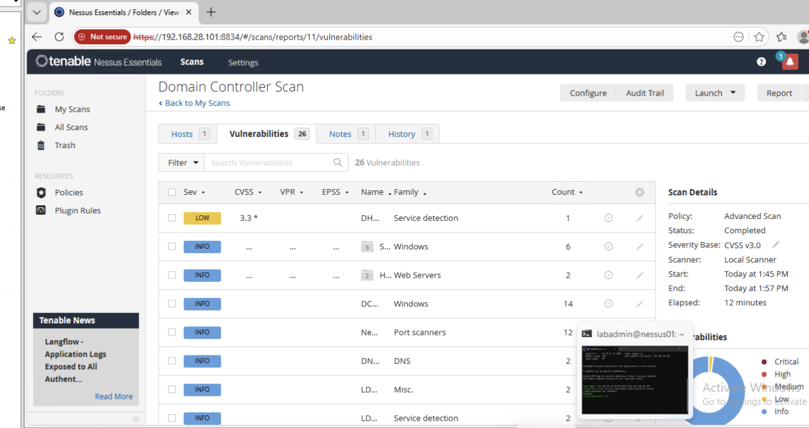
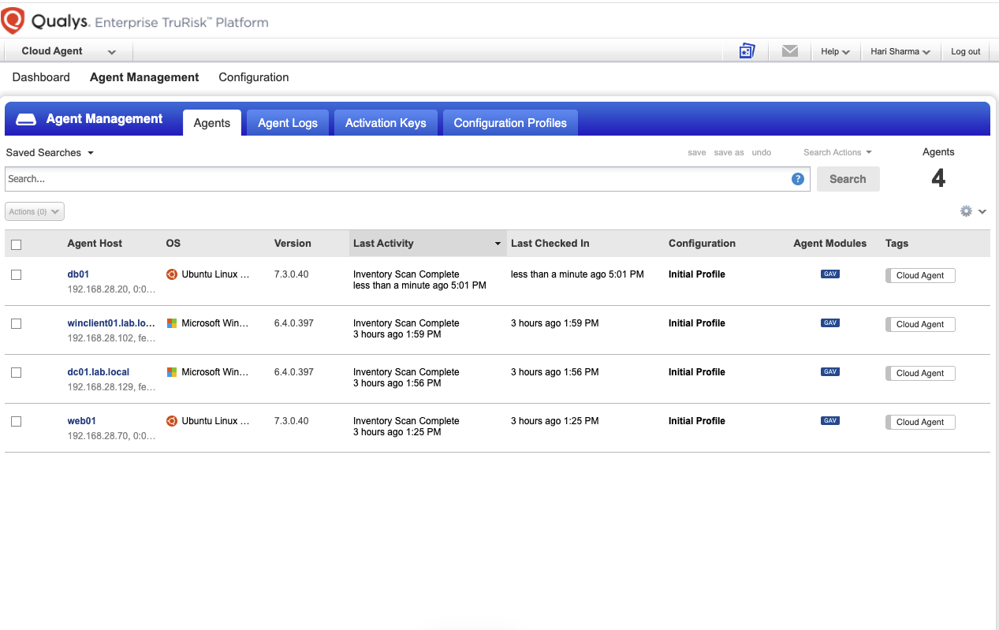

# Enterprise Security Governance & Compliance

## Overview

This repository represents a comprehensive enterprise security environment covering governance, risk management, architecture, operations, and resilience.

The structure reflects how security is designed, implemented, and managed across an organization, with a focus on identity, control effectiveness, and continuous improvement.

## 🚀 Highlights

- Enterprise security governance framework
- Identity-first architecture (Active Directory + RBAC)
- SIEM-based detection and response (Splunk, Wazuh, Elastic)
- Vulnerability management (Nessus, Qualys)
- Cloud security guardrails and DevSecOps integration
---

## Security Approach

The environment is built on the following principles:

* Governance-driven decision making
* Risk-based prioritization
* Identity as the primary control plane
* Segmentation and controlled access
* Continuous monitoring and validation
* Measurable security outcomes

---
## Repository Structure

- 00_strategy-governance/
- 01_risk-management/
- 02_security-architecture/
- 03_identity-security/
- 04_network-security/
- 05_endpoint-application-security/
- 06_vulnerability-management/
- 07_security-operations/
- 08_data-protection/
- 09_resilience/
- 10_metrics-assurance/
- 11_reporting/

---

## Core Capabilities

### Governance and Risk

* Security strategy and policy framework
* Risk identification and tracking
* Asset classification and ownership

### Identity and Access

* Identity lifecycle management
* Privileged access control
* Access certification and governance

### Architecture and Network

* Segmented network design
* Zero trust principles
* Controlled communication paths

### Security Operations

* Centralized monitoring and logging
* Detection engineering and alerting
* Incident response and threat hunting

### Vulnerability Management

* Continuous vulnerability scanning
* Risk-based remediation
* Exception and SLA management

### Data Protection

* Data classification and handling
* Encryption standards
* Data loss prevention strategy

### Resilience

* Business continuity planning
* Disaster recovery procedures
* Backup and restoration strategy

### Metrics and Assurance

* Security metrics and reporting
* KPI and KRI tracking
* Control validation and improvement

---

## Environment Overview

The environment includes:

* Identity systems (Active Directory)
* Network security controls (firewall and segmentation)
* Monitoring and logging platforms (SIEM)
* Vulnerability management systems
* Application, database, and storage systems

Cloud platforms are integrated as part of the overall architecture and follow the same governance and control model.

---

## Architecture Diagrams

* docs/diagrams/network-architecture.md
* docs/diagrams/zero-trust.md

---
## 📁 Implementation Artifacts

Supporting artifacts from the security implementation are organized below. These demonstrate hands-on configuration, monitoring, and validation across multiple security domains.

---
## 🔐 Identity & Access Management

### 📌 Active Directory Enterprise Implementation

Designed and implemented an enterprise-grade Active Directory environment to simulate centralized identity and access management aligned with security governance and compliance principles.

### 🏗️ OU Architecture

* Admin (Privileged-Accounts, Service-Accounts, Groups)
* Workstations (IT, HR, Finance)
* Servers (Domain-Controllers, Web, Database, Storage)
* Security (Defensive, Offensive)

---

### 👥 Role-Based Access Control (RBAC)

* IT_Admins
* HR_Users
* Finance_Users
* Server_Admins
* DB_Admins
* SOC_Analysts
* Red_Team

Users are assigned to groups based on job roles, enforcing least privilege.

---

### 👤 Identity Lifecycle

* admin.user → Privileged-Accounts
* it.user → IT
* hr.user → HR
* finance.user → Finance

---

### ⚙️ Group Policy (GPO)

* Password length: 8
* Complexity: Enabled
* Max age: 30 days
* Min age: 2 days

---

* Identity system configurations and controls
* Authentication and authorization mechanisms

---

### 🌐 Network Security Controls

* Network segmentation and traffic control
* Firewall and access enforcement configurations

---

### 🔍 Security Monitoring Platforms (SIEM)

#### Splunk – Log Analysis & Investigation

#### Wazuh – Endpoint Detection & Alerts

#### Elastic Stack – Log Correlation & Visualization

---

### 🛡️ Vulnerability Management

#### Nessus – Vulnerability Scanning

#### Qualys – Enterprise Vulnerability Platform

---

### 🔐 Data Protection Controls

* Data security configurations
* Protection mechanisms and policy enforcement

---

## ☁️ Cloud Security & DevSecOps Integration

Cloud environments are integrated into the overall enterprise architecture and governed using the same security principles, with additional focus on automation and scalability.

### 🔐 API Security & Application Guardrails

API security is implemented as part of the application security domain, with controls designed to enforce secure-by-default deployments.

Key controls include:

- Authentication and authorization using OAuth2/JWT
- Input validation to prevent injection attacks
- Rate limiting and abuse prevention
- Secure API gateway configurations
- Logging and monitoring of API activity

### ⚙️ Security Guardrails (Policy Enforcement)

Security controls are operationalized through automated guardrails to ensure consistency and prevent misconfigurations:

- Infrastructure-as-Code (Terraform) for secure resource deployment
- Standardized API gateway configurations with enforced security controls
- CI/CD security checks to prevent insecure deployments
- Policy-as-code to enforce compliance requirements

### 🔍 Continuous Monitoring (CSPM Integration)

Cloud security posture is continuously validated using modern platforms such as Wiz:

- Detection of misconfigurations and exposed resources
- Identification of vulnerable workloads and attack paths
- Correlation of IAM exposure, network access, and data sensitivity
- Risk-based prioritization of findings

This enables the organization to move from reactive security to proactive risk management.

---

## Key Outcomes

* Centralized visibility across systems
* Controlled and monitored access
* Reduced attack surface through segmentation
* Timely detection and response to threats
* Measurable and continuously improving security posture

---
## Author

Hari Sharma  
Security Engineering | Cloud | Enterprise Security

---

## Disclaimer

This repository is intended to demonstrate security design, implementation, and operational practices.

